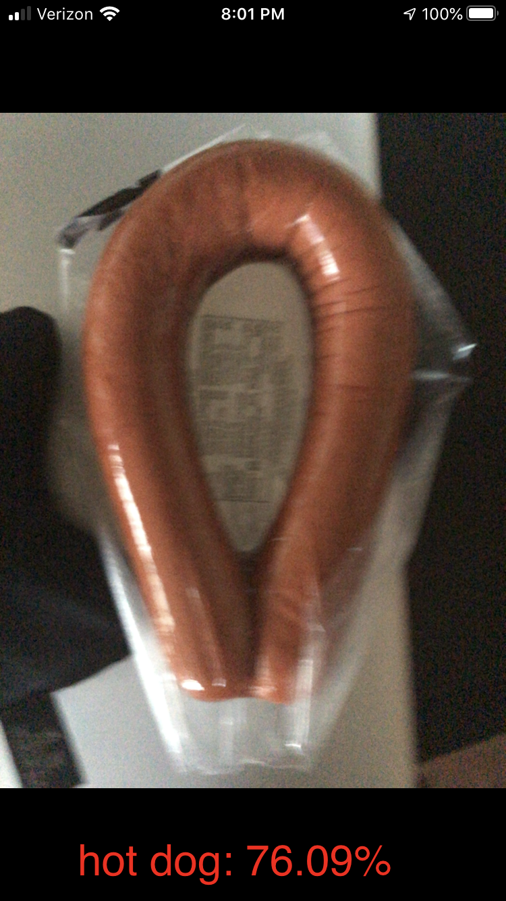

# Final Result

Steps towards reproducing results:
  # Data gathering
  Run the `download_multiple` function inside of `download_google_images.py`. Example usage:
  
      download_multiple({"search_words": ["plane", "dog", "hot dog"],
                     "dir": "pictures",
                     "max_count": 1000,
                     "chrome_driver": "/usr/local/custom_bin/chromedriver",
                     "headless": True})

This will create the following directory:
      
      pictures/
          - dog/
          - plane/
          - /hot\ dog/
          

We are trying to train a binary classifier, so you need to condense the previous folders into 2 classes: my 2 classes are "hot dog" and "not hot dog" I am using tensorflow `ImageDataGenerator()` to create datasets ingestible by a CNN, to get data in this form, we need our folder structure to look like:
      
      data/
          - train/
              - hot\ dog/
              - not\ hot\ dog/
          - val/
              - hot\ dog/
              - not\ hot\ dog/
          - test/
              - hot\ dog/
              - not\ hot\ dog/
          
      
Inside of `data_prep.py`, `create_batches` will achieve this.
Now, from `main.py`, we will reference this `data` folder to actually train our CNN. Running this file will create `.h5` models at every epoch. You can test this model using `pred.py`.

Now we must use `convert.py` to convert it to an `.mlmodel`, which is the format iOS uses.

`ViewController.swift` has the necessary swift code for model inference using the native camera. Make sure to add the camera privacy description in your `info.plist`
